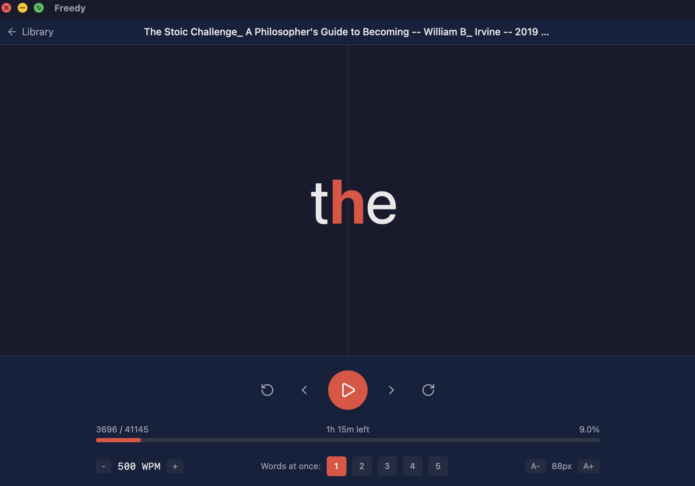

# fReedy

fReedy is a free, open-source desktop speed reader that uses RSVP (Rapid Serial Visual Presentation). Works with EPUB, PDF, or text files. Supports reading at up to 1500 words per minute.



## Download

[Download the latest release for macOS or Windows HERE](https://github.com/trassmann/freedy/releases/latest)

## Why fReedy?

I wasn't satisfied with the existing RSVP reader solutions. They are either browser extensions or web apps, have horrible UIs, or aren't free. fReedy is a simple desktop app that runs completely offline, has a decent UI and is free and open source.

## Features

- **Import anything** - EPUB, PDF, plain text, Markdown
- **Adjustable speed** - 100 to 1500 WPM, change on the fly
- **ORP highlighting** - the optimal recognition point is highlighted so your eyes don't have to search for it
- **Smart pacing** - automatically pauses longer at sentence endings and punctuation
- **Multi-word mode** - display 1-5 words at a time
- **Time estimate** - see how much reading time is left
- **Progress tracking** - picks up where you left off, even if you remove and re-add a book
- **Dark mode** - system, light, or dark
- **Keyboard-driven** - full keyboard shortcut support

## Keyboard Shortcuts

| Key | Action |
|---|---|
| Space | Play / Pause |
| Left / Right | Skip 1 word |
| Shift+Left / Right | Skip 10 words |
| Up / Down | Adjust WPM |
| Escape | Back to library |

## Development

You'll need [Rust](https://rustup.rs/), [Node.js](https://nodejs.org/) (v20+), and [pnpm](https://pnpm.io/) (v10+).

```bash
pnpm install
pnpm tauri dev
```

To build for production:

```bash
pnpm tauri build
```

## License

MIT
